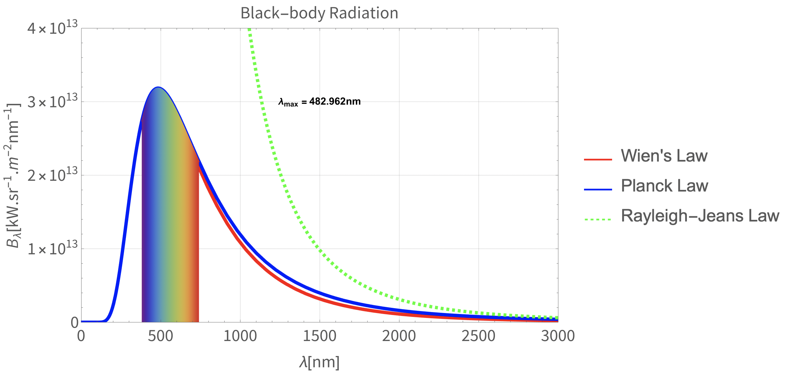

# Black-body-Radiation

### Rayleigh - Jeans Law

### Planck's Law

### Wien's Approximation 

# Licence
Released under licence: the GPL version 3 license.

Using without reference is, among other things, against the current license agreement (GPL).

Scientific or technical publications resulting from projects using this code are required to citate.
